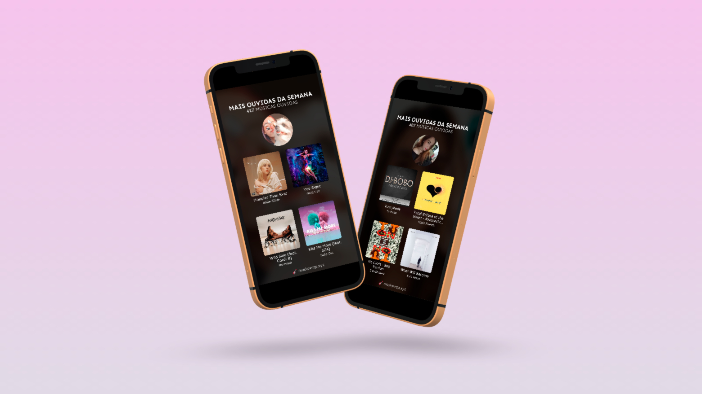

  

**musicwrap.xyz** is a website that allows you to generate collages with the songs you've heard the most in the last week, ready to be shared to your Instagram story. This repository contains the project's front-end built in React, while its API that generates the images is available at [musicwrap-api](https://github.com/doceazedo/musicwrap-api).

---

O **musicwrap.xyz** é um site que te permite gerar colagens com as músicas que você mais ouviu na última semana, pronta para ser compartilhada nos stories. Esse repositório contém o front-end do projeto construído em React, já a API que cria as imagens está disponível em [musicwrap-api](https://github.com/doceazedo/musicwrap-api).