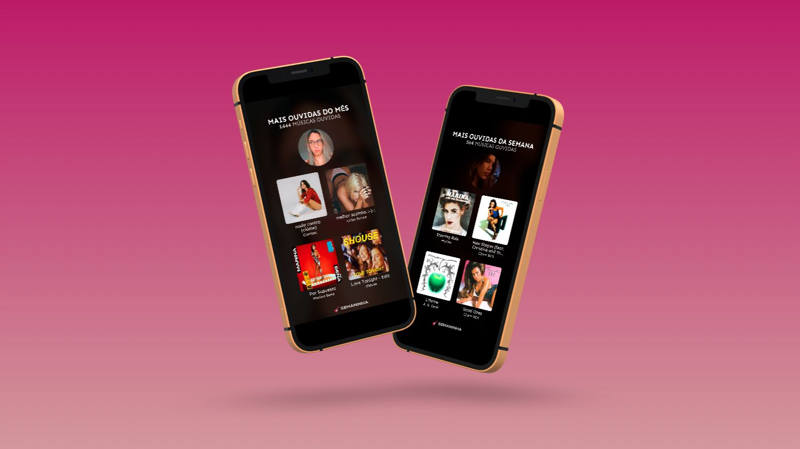

<h1 align="center">
  
</h1>

  

**Semaninha** (previously, musicwrap.xyz) is a website that allows you to generate collages with the songs you listened to the most with different themes and ready to share. This is the third iteration of this project, it was originally developed in Svelte with a vanilla PHP backend, later rewritten with React and Fastify and now centralized in this single SvelteKit application.

✨ _Documentation on how to collaborate and create new themes coming really soon!_